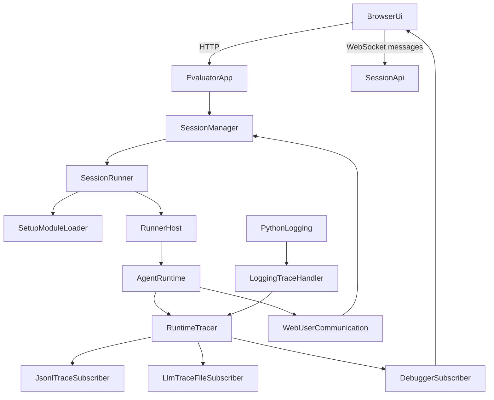

# Agent Evaluator, Web Runtime, and Unified Tracing Architecture

> This document captures the agreed requirements and architectural decisions for adding a web-based agent evaluator, debugger, and future test-bed to the framework. It is written to be self-contained so another implementation agent or engineer can execute it without access to prior conversation history.
>
> See also: [Overview](./overview.md) · [Host & Orchestration](./host-orchestration.md) · [Tracing & Evaluation](./tracing-evaluation.md) · [Extension Points](./extension-points.md) · User guide: [Using the agent evaluator](../guides/using-agent-evaluator.md)

---

## 1. Purpose

The framework needs a first-class **agent evaluator / debugger / test bed** with:

- a local web UI with a richer user experience than the console,
- the ability to select an agent,
- the ability to select a custom Python setup file that defines tools, internal data, prompt templates, and test hooks,
- interactive prompt entry,
- near-realtime visibility into what the runtime is doing,
- interactive clarification handling when the agent asks questions,
- a main response area for rendered agent output,
- room for future batch evaluation and scoring workflows.

The result should feel closer to an agent studio or debugger than a plain CLI runner.

This document is **not** a step-by-step implementation plan. It records the target architecture, behavior, interfaces, and decisions. For **what is implemented in this repository**, see **§16.1 Implementation status** at the end.

---

## 2. Goals

### 2.1 Primary goals

- Provide a browser-based runtime experience for single interactive agent runs.
- Preserve the existing host-orchestrated execution model instead of creating a second independent runtime.
- Replace fragmented observability with a unified event/tracing pipeline.
- Support interactive clarification and host/user interaction from the browser.
- Support custom setup code loaded from a Python file package for evaluator sessions.
- Support both browser-driven and command-line-only execution modes.
- Keep the evaluator app isolated from the core runtime while still promoting reusable runtime capabilities into the framework.

### 2.2 Secondary goals

- Reserve space and contracts for future test-set editing and scoring.
- Preserve or improve existing file-based trace and logging workflows through adapters.
- Make the design usable by another agentic framework even if class and file names differ.

### 2.3 Non-goals for the first implementation

- Full batch scoring and test-suite authoring UX.
- Replacing the existing console mode.
- Introducing a remote multi-user server deployment model.
- Requiring a heavyweight external application stack when a local Python-hosted web app is sufficient.

---

## 3. User-Facing Requirements

The first release must satisfy all of the following:

1. A local web UI can be launched from the command line.
2. The user can select an agent to run.
3. The user can select a custom Python setup file.
4. The setup file may provide a prompt template or schema-like structure to guide prompt entry.
5. The user can enter or load a prompt.
6. The agent can be invoked against that prompt.
7. The UI shows runtime activity in near realtime.
8. Trace display is hierarchical and expandable.
9. The default trace view is compact and readable, not raw JSON spam.
10. Clicking or expanding a node reveals JSON or detailed payloads.
11. If the agent asks for clarification, the user can answer interactively in the UI.
12. If the agent sends a final response, it appears in the main response area.
13. The app can also run fully from the command line without the browser.
14. CLI mode can accept prompt files and setup files and write results to stdout or an output artifact.
15. The design must leave explicit UI and backend room for a future test-set editor and summary results view.

---

## 4. High-Level Architecture

The target architecture has three major parts:

- **Core runtime changes**: reusable web-hosted runtime support and unified tracing inside the framework.
- **Evaluator application**: a separate installable package that hosts the UI, manages sessions, and adds evaluator-specific features.
- **Future evaluation/scoring layer**: built on the same runtime and tracing contracts later.



### Core principle

The **host/runtime stays the source of truth for execution**.

The evaluator application must not become a parallel orchestrator that reimplements:

- agent loading,
- tool execution,
- subagent execution,
- callback resolution,
- model invocation rules.

Instead, the evaluator app should build on a **web-hosted runtime surface** exposed by the framework.

---

## 5. Core Architectural Decisions

### 5.1 Keep `AgentHost` as the orchestration core

The current orchestration model already has the right boundary:

- `AgentHost` manages registries and execution.
- `UserCommunication` is already the abstraction for user interaction.
- provider request/response tracing already exists.
- hook/event lifecycle points already exist.

The new design should extend those seams rather than replace them.

### 5.2 Add a web-hosted runtime surface, not a separate host implementation

The framework should gain the equivalent of console-mode support for browser-backed runs.

This means adding a reusable web runtime surface such as:

- `WebUserCommunication`
- `create_web_host(...)` and/or `AgentHost.from_env(..., user_comm=...)` with an attached `CompositeRuntimeTracer`
- tracer attachment points suitable for live debugger subscribers

This does **not** mean building a full `WebAgentHost` clone that duplicates all host behavior.

If a subclass or wrapper is introduced, it should stay thin and primarily add:

- session identity,
- tracer wiring,
- browser-facing input/output coordination,
- convenience construction for web apps.

### 5.3 Introduce a unified tracer as the primary observability abstraction

The current design splits observability across:

- file-based audit tracing,
- provider LLM trace logging,
- console lifecycle logging.

That fragmentation should be replaced with a **single structured event pipeline**.

The unified tracer becomes the primary abstraction.
File writers, browser debugging, and classic LLM trace logs become downstream consumers.

### 5.4 Treat Python logging as an ingress adapter, not the core abstraction

Python `logging` should not be the main observability system.

Instead:

- runtime-native events publish directly into the tracer,
- a logging handler/consumer converts `LogRecord` objects into tracer events,
- file writing and debugger streaming consume tracer events downstream.

This allows logs outside the immediate agent loop to appear in the debugger when desired.

### 5.5 Keep the evaluator app isolated

The evaluator should live in a separate installable package under `src`, not as more flags added to the core CLI.

The framework should expose reusable runtime capabilities.
The evaluator package should compose them into a product-like application.

---

## 6. Unified Tracing Architecture

## 6.1 Concept

The framework should expose a tracing/event system with these roles:

- **publishers**: runtime code that emits structured events,
- **ingress adapters**: sources like Python `logging` that are normalized into structured events,
- **subscribers**: components that persist, forward, filter, or visualize events.

## 6.2 Core event model

The event model should be explicit and stable. A representative shape is:

```python
from dataclasses import dataclass, field
from typing import Any, Literal, Protocol

TraceChannel = Literal["runtime", "llm", "system", "user"]
TraceLevel = Literal["debug", "info", "warning", "error"]

@dataclass(frozen=True, slots=True)
class TraceContext:
    session_id: str | None = None
    run_id: str | None = None
    agent_id: str | None = None
    caller_id: str | None = None
    tool_name: str | None = None
    subagent_id: str | None = None
    conversation_id: str | None = None

@dataclass(frozen=True, slots=True)
class TraceEvent:
    event_id: str
    parent_event_id: str | None
    span_id: str | None
    parent_span_id: str | None
    timestamp: str
    channel: TraceChannel
    level: TraceLevel
    kind: str
    title: str
    summary: str = ""
    context: TraceContext = field(default_factory=TraceContext)
    payload: dict[str, Any] = field(default_factory=dict)
    tags: tuple[str, ...] = ()

class TraceSubscriber(Protocol):
    def consume(self, event: TraceEvent) -> None: ...

class RuntimeTracer(Protocol):
    def publish(self, event: TraceEvent) -> None: ...
    def child(self, **context_updates: Any) -> "RuntimeTracer": ...
    def subscribe(self, subscriber: TraceSubscriber) -> None: ...
    def unsubscribe(self, subscriber: TraceSubscriber) -> None: ...
```

The exact names may differ, but the semantics should remain.

## 6.3 Channels

Use channel separation to keep consumers simple:

- `runtime`: agent/tool/subagent/callback/test-hook lifecycle
- `llm`: provider request/response payloads
- `system`: framework or application log events
- `user`: prompts, clarifications, permissions, outgoing messages, streamed output

## 6.4 Levels

At minimum:

- `debug`
- `info`
- `warning`
- `error`

The debugger should usually subscribe to all levels.
Production-oriented subscribers may filter out `debug`.

## 6.5 Event taxonomy

The first release should include at least these event kinds:

- `runtime.session_started`
- `runtime.session_finished`
- `runtime.session_error`
- `runtime.suite_setup_started`
- `runtime.suite_setup_finished`
- `runtime.test_setup_started`
- `runtime.test_setup_finished`
- `runtime.agent_started`
- `runtime.agent_finished`
- `runtime.decision_made`
- `runtime.tool_call_started`
- `runtime.tool_call_finished`
- `runtime.subagent_call_started`
- `runtime.subagent_call_finished`
- `runtime.callback_requested`
- `runtime.callback_answered`
- `runtime.skill_invoked`
- `runtime.permission_requested`
- `runtime.permission_resolved`
- `runtime.test_teardown_started`
- `runtime.test_teardown_finished`
- `runtime.suite_teardown_started`
- `runtime.suite_teardown_finished`
- `user.prompt_requested`
- `user.prompt_answered`
- `user.message_sent`
- `user.stream_chunk`
- `llm.request`
- `llm.response`
- `system.log`

## 6.6 Span and hierarchy rules

The UI trace tree must not be reconstructed from file order heuristics.

Use explicit hierarchy:

- `event_id`: unique identifier for each event
- `span_id`: logical operation identifier
- `parent_span_id`: nesting relationship between operations
- `parent_event_id`: optional sequencing aid

The UI tree should primarily use `span_id` and `parent_span_id`.

Typical span owners:

- session
- suite setup
- test setup
- agent run
- model request/response cycle
- tool call
- subagent call
- callback interaction
- teardown hook

## 6.7 Subscribers and adapters

### Required subscribers

- `JsonlTraceSubscriber`
  - writes structured events or assembled run summaries to disk
- `LlmTraceFileSubscriber`
  - writes LLM-channel events to dedicated files when classic trace output is enabled
- `DebuggerSubscriber`
  - forwards events to the browser in near realtime

### Required ingress adapter

- `LoggingTraceHandler` or equivalent
  - receives Python `LogRecord` objects
  - normalizes them into `system.log` events
  - republishes them into the tracer

## 6.8 Integration with tracing modules (as implemented)

This table describes **current** wiring, not a pending migration:

| Piece | Role |
|-------|------|
| `tracing.py` | Canonical **`TraceEvent`** / **`RuntimeTracer`** pipeline; **`CompositeRuntimeTracer`** fans out to subscribers. |
| `runtime_trace_behavior.py` | **`RuntimeTraceBehavior`** — attached per run by **`AgentHost`** when **`runtime_tracer`** is not **`NullRuntimeTracer`**; emits core **`runtime.*`** events. |
| `tracing_bridge.py` | **`active_tracer_scope`** + **`try_publish_trace`** — **`user.*`** from web/console comm; **`system.log`** mirror from **`TraceLoggingBehavior`**. |
| `llm_trace_logging.py` | Publishes **`llm.*`** to **`host.runtime_tracer`** when LLM trace logging is enabled; may still use **`LlmTraceLogger`** for console/file alongside that. |
| `trace_logging.py` | Console lifecycle lines for developers; lines optionally mirrored into the unified tracer when a run is scoped. |
| `audit_trace.py` | **Parallel** JSONL audit trail (**not** built from **`TraceEvent`**). Optional future: subscriber adapter — see [Tracing & Evaluation](./tracing-evaluation.md). |
| `_TracingUserCommunication` | Still wraps comm for audit when an audit tracer is enabled; unified **`user.*`** events use the bridge separately. |
| `RecordingAgentHost` | Still used by regression **`evaluator.py`** harnesses; unified tracing does not replace that recording layer. |

---

## 7. Web-Hosted Runtime

## 7.1 Required behavior

The framework should support a web-backed runtime mode analogous to console mode.

The web runtime should:

- resolve config from `.env` or explicit settings,
- create and start a host,
- wire a browser-backed `UserCommunication`,
- attach a tracer and selected subscribers,
- expose a session-aware interaction boundary,
- support graceful shutdown.

**Shipped shape:** there is no separate **`from_env_web`** entrypoint. The **`agent_framework_evaluator`** app uses **`AgentHost.from_env(env_path, user_comm=WebUserCommunication(...))`** (after **`await host.start()`** where needed), assigns **`host.runtime_tracer`** to a **`CompositeRuntimeTracer`** with debugger/WebSocket subscribers, and **`SessionRunner.run_once`** sets **`host.trace_context_overlay`** for the duration of **`run_agent`**. For ad hoc integrations, **`create_web_host(...)`** in **`web_host.py`** builds a host with a supplied tracer and user comm — see [Host & Orchestration](./host-orchestration.md).

## 7.2 `WebUserCommunication`

The browser-backed communication layer must implement the same conceptual responsibilities as console communication:

- send final or intermediate messages,
- request a freeform answer,
- request a structured answer,
- request confirmation,
- request permission,
- optionally stream output.

The important behavioral difference is that web interaction is session-scoped and asynchronous from the browser’s perspective.

## 7.3 Session scoping

Every browser run needs a session boundary with:

- session id,
- selected agent id,
- selected setup module,
- live tracer/debug subscriber attachment,
- pending clarification requests,
- current run state,
- response transcript,
- recent trace snapshot or replay buffer.

---

## 8. Runner Host and Session Execution

## 8.1 Concept

The evaluator application should run interactive sessions through a **runner host**.

The runner host is not a new orchestration system.
It is a thin runtime host wrapper or specialized host instance used for evaluator sessions.

Its responsibilities are:

- attach session context,
- attach tracer and subscribers,
- expose session-aware user communication,
- publish evaluator-specific lifecycle events where needed,
- remain compatible with the existing host protocol expected by agents and tools.

## 8.2 Session runner behavior

Each browser run should execute like this:

1. Create a new session id.
2. Load the selected setup module.
3. Create a runner host with web user communication and tracer wiring.
4. Run suite setup once for the session or suite scope.
5. Run test setup for the current prompt/test case.
6. Render or resolve the prompt from template plus user input.
7. Invoke the selected agent.
8. Stream runtime events to the browser as they happen.
9. If the agent asks for clarification, pause on the browser-backed input queue until the user submits an answer, then resume.
10. Render the final agent response in the main UI area.
11. Run test teardown.
12. Later, if the suite/session ends, run suite teardown.

## 8.3 Concurrency model

The current agent loop is synchronous.

The web app should therefore:

- keep the browser/server event loop responsive,
- run each session’s main agent execution on a worker thread or equivalent isolated execution context,
- keep tracer publishing thread-safe,
- allow UI subscribers to receive events immediately,
- avoid blocking the web server while a run is in progress.

---

## 9. Setup Module Contract

## 9.1 Purpose

The evaluator must accept a custom Python setup file that can:

- register tools,
- prepare internal state,
- define prompt templates,
- provide suite-level setup and teardown,
- provide test-level setup and teardown.

## 9.2 Expected interface

The initial contract should support the following optional members:

- `PROMPT_TEMPLATE: str | None`
- `def get_prompt_template() -> str | dict | None`
- `def register(host, session_context) -> None`
- `def suite_setup(session_context) -> None`
- `def suite_teardown(session_context) -> None`
- `def test_setup(test_case, session_context) -> None`
- `def test_teardown(test_case, session_context) -> None`

## 9.3 Session context contract

`session_context` should expose at least:

- selected agent id
- active session id
- config/env paths
- mutable scratch state for the setup package
- tracer or event emitter
- current test case metadata when applicable

## 9.4 Execution semantics

- The setup package runs in-process for maximum flexibility in the first version.
- Suite hooks run once for the current suite/session scope.
- Test hooks run around each prompt execution.
- Setup failures must surface clearly in the UI and CLI artifacts as structured errors.

---

## 10. Evaluator Application Boundary

The evaluator application should live in a separate installable package under `src`.

Representative structure:

- `src/agent_framework_evaluator/__main__.py`
- `src/agent_framework_evaluator/cli.py`
- `src/agent_framework_evaluator/app.py`
- `src/agent_framework_evaluator/session_manager.py`
- `src/agent_framework_evaluator/runtime/session_runner.py`
- `src/agent_framework_evaluator/runtime/setup_loader.py`
- `src/agent_framework_evaluator/runtime/debug_subscriber.py`
- `src/agent_framework_evaluator/models.py`
- `src/agent_framework_evaluator/web/`

The names may change, but the package boundary should not:

- core runtime and generic tracing support belong in the framework,
- evaluator-specific session management and UI belong in the evaluator package.

---

## 11. Web UI Requirements

## 11.1 Main layout

The UI should include:

- a left control rail
  - agent selector
  - setup file selector
  - mode selector: `Single Run` and later `Test Set`
  - recent sessions or runs
- a center main pane
  - prompt editor
  - prompt-template guidance if provided by the setup file
  - final response area
- a right trace pane
  - hierarchical runtime tree
  - expandable nodes
  - filtering by type or severity
- a reserved lower pane or secondary tab
  - future test-set editor
  - future summary results view

## 11.2 Trace presentation

The trace UI should behave like this:

- Default: compact hierarchy only
- Expanded node: reveal JSON payloads, detailed inputs/outputs, callback prompts, tool parameters, model payloads, or log details
- Near realtime: the user sees new trace nodes as activity happens
- Status visibility: active node or active operation should be visually obvious
- Filtering: users should be able to reduce noise with channel filters and a logging-level filter (`error`, `warning`, `info`, `debug`) for `log` events. Evaluator diagnostics use this path so debug mode can reveal the evaluation input, full evaluator LLM prompt, and evaluator result without making those payloads visible by default.

## 11.3 Clarification UX

If an agent asks for clarification:

- the UI must present the question immediately,
- the run should pause in a visible waiting state,
- the user must be able to answer without losing the trace context,
- the answer must resume the same run,
- both the question and answer must appear in the trace.

## 11.4 Final response UX

The final response should appear in the central result area, not only in the trace.

If the runtime also sends intermediate assistant messages, those may appear in a transcript or conversation area, but the final answer must still be clearly rendered as the run outcome.

---

## 12. CLI and Headless Requirements

The evaluator must also work without a browser.

Representative commands:

```bash
agent-eval web --env .env --open-browser
agent-eval run --agent my_agent --setup path/to/setup.py --prompt @prompt.txt --output run.json
agent-eval run --agent my_agent --setup path/to/setup.py --prompt-file case.json
agent-eval score --suite path/to/suite.yaml --output results.json
```

The first implementation only needs `web` and `run`.

CLI mode requirements:

- select agent by id
- load setup file
- load prompt from literal text or file
- emit final result to stdout or output file
- emit structured trace artifacts when configured
- support later suite/test-set inputs without redesigning the command surface

---

## 13. Future Test-Set and Scoring Support

This is intentionally deferred, but the current design must preserve room for it.

The future evaluation model should support:

- multiple prompts/test cases,
- expected output or expected properties,
- constraints on execution behavior
  - required callbacks
  - forbidden tools
  - required tools
  - expected output format
- aggregate scoring criteria,
- per-case and overall summaries.

The UI should reserve space now so later scoring does not require a layout rewrite.

The tracing system is intentionally designed so future scoring can attach as a subscriber or post-run analyzer.

---

## 14. Expected End-to-End Behavior

## 14.1 Browser interactive run

1. User launches the evaluator web app.
2. Browser opens locally.
3. User selects an agent.
4. User selects a setup module.
5. Setup module may contribute a prompt template or guidance.
6. User enters prompt content.
7. User starts the run.
8. Session runner creates a runner host and tracer.
9. Suite/test hooks run as appropriate.
10. Agent executes.
11. Trace tree updates in near realtime.
12. Python logging and LLM/provider events may also appear in the trace if enabled.
13. If the agent asks for clarification, the browser prompts the user.
14. User answers.
15. Run resumes.
16. Final answer appears in the main result pane.
17. Trace remains available for expansion and inspection.

## 14.2 CLI/headless run

1. User runs a command with agent id, setup file, and prompt input.
2. Setup module loads.
3. Runner host executes with tracer and file subscribers.
4. Final result is printed or written to an artifact.
5. Trace artifacts are optionally written to disk.

---

## 15. Implementation Guidance for This Repository

If implemented in this repository, the likely split is:

### Promote into core framework

- unified tracing abstraction and event model
- logging ingress adapter
- tracer-aware host wiring
- tracer-aware web user communication
- web-hosted runtime factory

### Keep in evaluator package

- session manager
- browser app
- WebSocket routes
- setup-module loader
- prompt/test-case editor models
- debugger subscriber
- future scoring UI

### Existing modules most affected

- `src/agent_framework/host.py`
- `src/agent_framework/user_communication.py`
- `src/agent_framework/console_communication.py`
- `src/agent_framework/audit_trace.py`
- `src/agent_framework/llm_trace_logging.py`
- `src/agent_framework/trace_logging.py`
- `src/agent_framework/evaluator.py`
- `src/agent_framework/__main__.py`

---

## 16. Acceptance Criteria

This architecture is correctly implemented when all of the following are true:

- A browser-based evaluator can launch locally from the command line.
- The evaluator can run any selectable agent through the existing host-driven runtime.
- A setup file can register tools and hooks and influence prompt input.
- Clarification requests are handled interactively in the browser.
- Final answers are shown in the main UI pane.
- Runtime activity appears in near realtime as a hierarchical expandable trace.
- Python logging can be routed into the same unified event system through a consumer/handler.
- File-based traces and LLM trace files are projections of the unified event stream, not separate primary systems.
- The evaluator remains isolated as a separate package.
- CLI-only execution works without the browser.
- The design still has a clean path to future test-set scoring and summary views.

### 16.1 Implementation status (shipped behavior)

As of 2026-04, the following gaps against this document are closed in code:

- **Runtime channel:** `RuntimeTraceBehavior` (`runtime_trace_behavior.py`) publishes structured `runtime.*` events from the agent lifecycle hooks (agent start/end, tool and subagent calls, skills, model/decision boundaries, callbacks). `AgentHost.run_agent` attaches this behavior per run (without mutating registry-cached agents), merges `trace_context_overlay` for evaluator sessions, and scopes `active_tracer_scope` so subscribers and user-comm see the active tracer.
- **Concurrency:** `CompositeRuntimeTracer.publish` uses a lock when fanning out to subscribers.
- **User channel:** `WebUserCommunication` and `ConsoleUserCommunication` publish `user.*` events when a tracer is active, via `tracing_bridge.try_publish_trace` (contextvar set for the duration of `run_agent`).
- **Console + unified trace:** `TraceLoggingBehavior` console lines can mirror into the tracer as `system.log` when scoped.
- **Main CLI:** `python -m agent_framework` supports `--runtime-trace-jsonl` and optional `--runtime-trace-python-logs` (requires JSONL path) without changing default console-only behavior.
- **Evaluator:** Trace tree UI nests by `parent_span_id`; `GET /api/agents`, `GET /api/setup-template`; `POST /api/sessions/{id}/close` and WebSocket teardown call `suite_teardown_if_any` (idempotent per runner). Headless `agent_framework_evaluator` CLI supports `--trace-jsonl` and `--trace-llm-dir`.
- **Audit JSONL:** Remains a **parallel** legacy path (`audit_trace.py`); it is not yet a subscriber of `TraceEvent`. A future adapter could project unified events into audit-shaped JSONL without removing existing audit behavior.

---

## 17. Summary

The target system is:

- a reusable **web-hosted runtime surface** added to the framework,
- a separate **evaluator application** built on top of that runtime,
- a **unified tracer** as the central observability contract,
- a **logging ingress adapter** so non-runtime logs can also enter that contract,
- a **debugger UI** that consumes first-hand events rather than reconstructing them from files,
- and a design that supports later expansion into a full scoring/evaluation studio.
